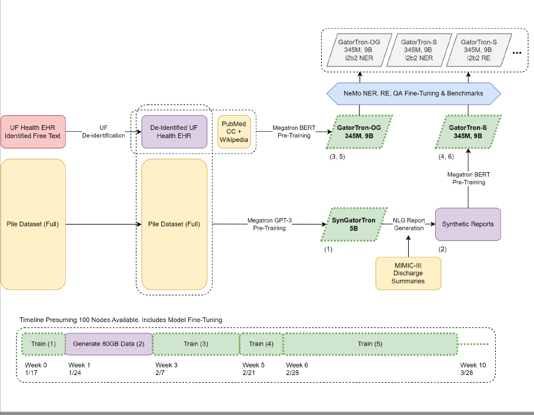

# GatorTronGPT

## Project Overview


## what is the this repo
- this is the repo containing all the code for training, evaluating and generate medical text with GPT models based on Megatron-LM
- this is the repo for GatorTronGPT project

## Reference
We have a preprint at
```
@misc{peng2023study,
      title={A Study of Generative Large Language Model for Medical Research and Healthcare}, 
      author={Cheng Peng and Xi Yang and Aokun Chen and Kaleb E Smith and Nima PourNejatian and Anthony B Costa and Cheryl Martin and Mona G Flores and Ying Zhang and Tanja Magoc and Gloria Lipori and Duane A Mitchell and Naykky S Ospina and Mustafa M Ahmed and William R Hogan and Elizabeth A Shenkman and Yi Guo and Jiang Bian and Yonghui Wu},
      year={2023},
      eprint={2305.13523},
      archivePrefix={arXiv},
      primaryClass={cs.CL}
}
```